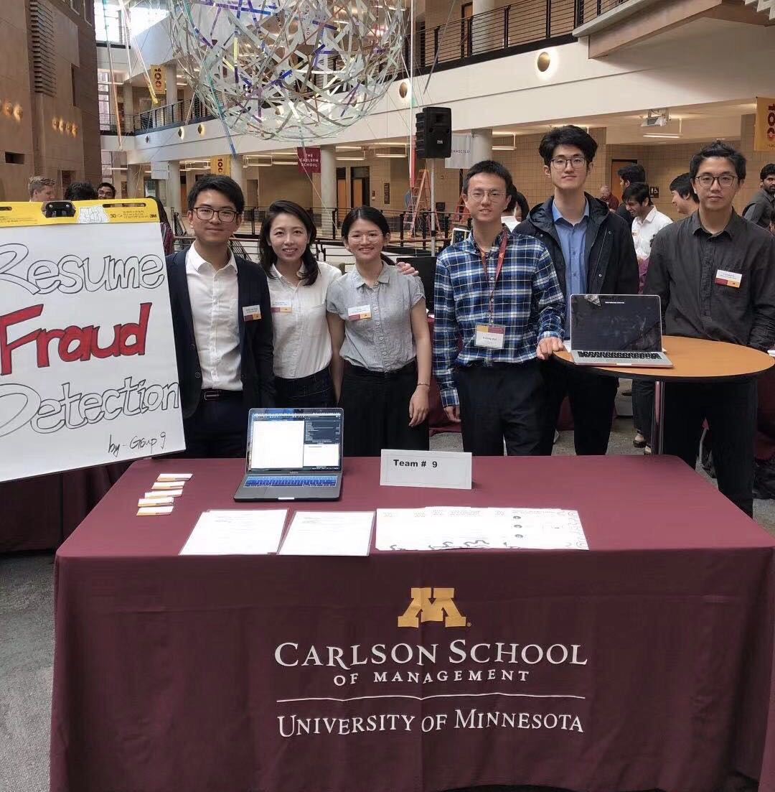

# Resume Fraud Detection

Recruiters are receiving too many resumes to read through them these days.  Instead, a lot of them use Applicant Tracking System (ATS) to simplify the recruiting processes by easily narrow down the applicant pool. One of the most common way ATS selects ideal candidate is keyword search. However, there are applicants who added transparent keywords to ensure ATS ranks their resumes with high relevance, which is known as <b>keyword stuffing</b>.

As for this project, our group wanted to spot keyword stuffing by <b>detecting and highlighting any hidden words existed in resumes</b>. This could potentially improve ATS by implementing this idea and identify resumes with keyword stuffing. We presented a live demo for fellow students and analytical professionals. Sources for this demo can be found [here](https://github.com/peterwei425/Resume-Fraud-Detection/tree/master/Demo). 

In addition, I created a resume scoring system <b>which provides each resume (in a PDF format) with a relevancy score </b>based on job descriptions using NLTK and TIKA in Python. It mimics the algorithms of ATS system, and it is used to demostrate the effect of keyword stuffing. The code can be found [here](https://github.com/peterwei425/Resume-Fraud-Detection/blob/master/Resume_Scoring_System.ipynb). The subset of data used, which contains 78 resume samples can be accessed [here](https://github.com/peterwei425/Resume-Fraud-Detection/blob/master/resume_samples.zip). 

Team: [Boyang Wei](https://www.linkedin.com/in/boyang-wei/), [Yuankun Huang](https://www.linkedin.com/in/yuankun-tyler-huang-94114b127/), [Elizabeth Zhu](https://www.linkedin.com/in/elizabethyizhu/), [Lin Xu](https://www.linkedin.com/in/lin-xu-8182ab15a/), [Yili Yu](https://www.linkedin.com/in/yili-yu-173b62179/), [Leo Xiong](https://www.linkedin.com/in/chuchen-leo-xiong/)

{:height="50%" width="50%"}
